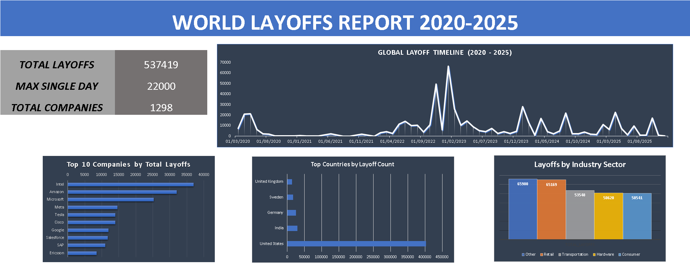

# 📉 World Layoffs Data Exploration (SQL & Excel)

## 📌 Project Overview
This project performs an end-to-end **Exploratory Data Analysis (EDA)** on global layoffs data. The goal is to analyze workforce reduction trends from the pandemic era (2020) to the current economic landscape (2024-2025).

The project consists of two main parts:
1.  **Data Analysis (MySQL):** Using advanced SQL queries to clean data and extract key insights.
2.  **Visualization (Excel):** Creating an interactive dashboard to visualize the impact across industries, countries, and time.

## 💾 Data Source
The dataset used in this project was obtained from Kaggle, containing global layoff data from 2020 to 2025.
- **Source:** [Kaggle - Layoffs Dataset](https://www.kaggle.com/datasets/swaptr/layoffs-2022) *(Original data sourced from Layoffs.fyi)*

## 🛠️ Tools & Techniques
- **MySQL:**
  - **Data Cleaning:** Removing duplicates, standardizing data types.
  - **Exploratory Analysis:** `SUM`, `MAX`, `GROUP BY` for aggregation.
  - **Advanced SQL:** `CTEs`, `Window Functions` (`DENSE_RANK`, `SUM OVER`) for trend analysis and ranking.
- **Microsoft Excel:**
  - **Dashboarding:** Creating a professional layout with KPI cards and charts.
  - **Data Visualization:** Line charts for trends, Bar charts for ranking.

## 📊 Key Findings
Based on the SQL analysis and Dashboard visualization:

### 1. The Scale of Crisis
- **Total Impact:** Over **1,298 companies** have conducted layoffs during this period.
- **Single Day Record:** The highest number of layoffs in a single day reached **22,000 employees**.
- **High Profile Failure:** **Britishvolt** was identified as the company with the highest funds raised that eventually went bankrupt (100% layoffs).

### 2. Market Leaders Impact
- **Top All-Time:** Cumulatively, **Intel** recorded the highest number of workforce reductions in this dataset.
- **Industry Hit:** The **"Other"** category topped the list, followed by specific major industries: **Retail**, **Transportation**, and **Hardware**, reflecting a broad economic impact across logistics and technology sectors.

### 3. Geographic Distribution
- While the United States dominates the global figures, **India** and **Germany** emerged as the most impacted countries in Asia and Europe, highlighting the global scale of the crisis.

### 4. Evolution of Crisis (Top Layoffs per Year)
Using *Window Functions*, we observed a shift in the crisis focus:
- **2020 (Pandemic):** **Uber** (Transportation hit by lockdowns).
- **2021 (Startup Bust):** **Katerra** (Construction tech collapse).
- **2022 (Post-Pandemic):** **Meta** (Efficiency restructuring).
- **2023 (Tech Winter):** **Google** (Profitability focus).
- **2024 - 2025 (Hardware Crisis):** **Intel** (Shift towards Semiconductor sector challenges).

### 5. Temporal Trend
- **Volatile Trend:** The data reveals a massive peak in layoffs around **early 2023**. Following this period, the trend remained volatile with intermittent spikes in 2024 and 2025, but recent data towards the end of 2025 indicates a potential **cooling down** in layoff activities.

## 📂 Project Files
You can view or download the source files here:

- **📄 SQL Script:** [Layoffs_EDA_Project.sql](Layoffs_EDA_Project.sql) (Contains all queries used for analysis).
- **📊 Excel Dashboard:** [World_Layoffs_Dashboard.xlsx](World_Layoffs_Dashboard.xlsx) (The full interactive dashboard file).

---
*This project is documented as part of a Data Analyst portfolio.*
